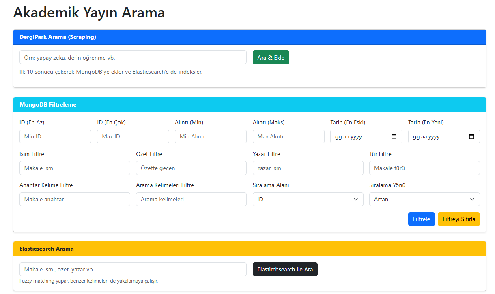
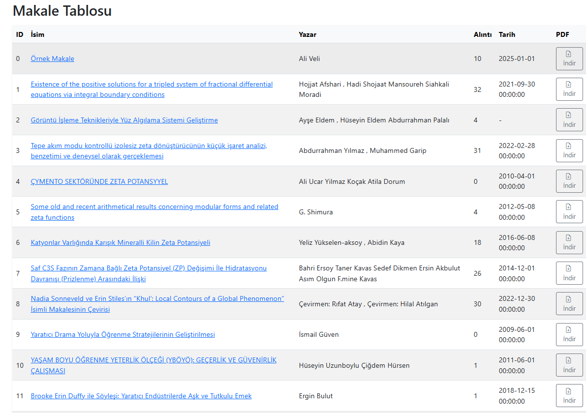
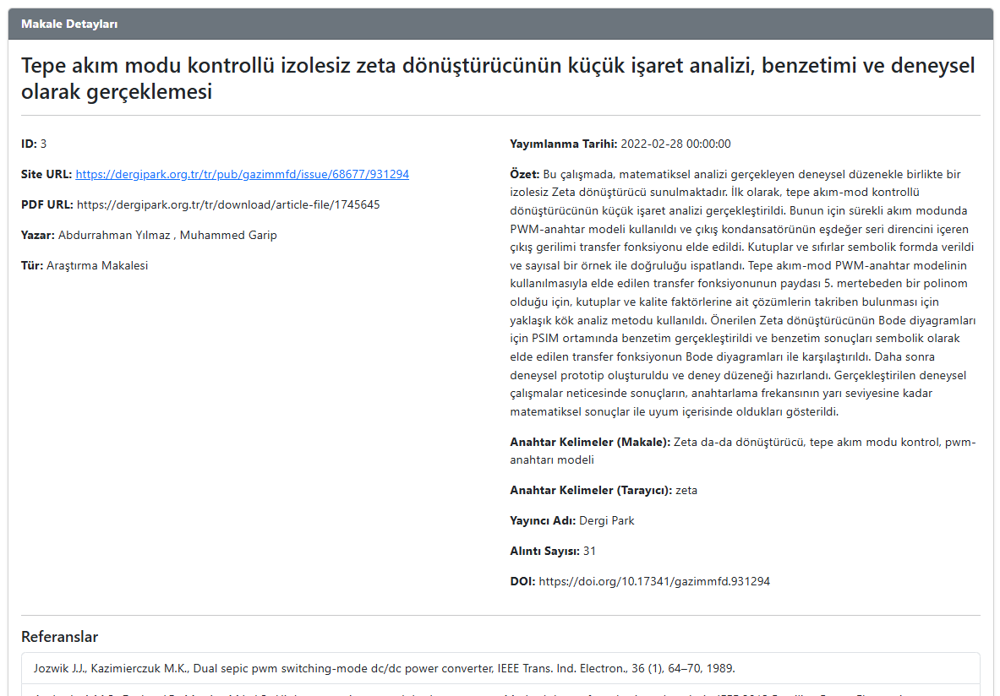
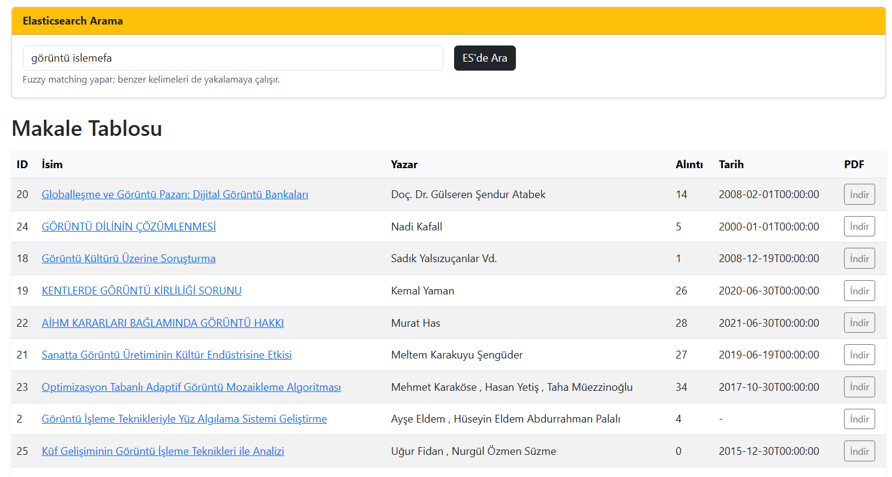

# Academic Search Platform

## İçindekiler

- [Genel Bakış](#genel-bakış)
- [Özellikler](#özellikler)
- [Kullanılan Teknolojiler](#kullanılan-teknolojiler)
- [Elasticsearch Entegrasyonu](#elasticsearch-entegrasyonu)
- [Uygulama Görselleri](#uygulama-görselleri)

---

## Genel Bakış

**Academic Search Platform**, akademik makaleleri **DergiPark** üzerinden otomatik olarak çeken, MongoDB’de güvenle saklayan ve Elasticsearch entegrasyonu sayesinde son derece hızlı ve esnek arama imkânları sunan modern bir web uygulamasıdır. Bu platform, araştırmacı, öğrenci ve akademisyenlerin makalelere zahmetsizce ulaşabilmesi, detayları inceleyebilmesi ve PDF dosyalarını indirebilmesi için tasarlanmıştır.

---

## Özellikler

### **Makale Yönetimi**
- **Web Scraping:** DergiPark'tan makale verilerini çeker.
- **Veritabanı :** Makaleler MongoDB’de güvenli bir şekilde depolanır.
- **Detaylı Görüntüleme:** Her makale için detay sayfası, tüm makale bilgileri, referanslar ve PDF indirme imkanı sunar.

### **Arama ve Filtreleme**
- **Gelişmiş Arama:** Elasticsearch entegrasyonu sayesinde, aradığınız makalelere hızlıca ulaşabilirsiniz.
- **Fuzzy Matching:** Yazım hatalarına toleranslı, benzer kelimeleri de yakalayan arama algoritması ile eksiksiz sonuçlar elde edin.
- **Detaylı Filtreleme:** ID, tarih, yazar, tür, anahtar kelime gibi çeşitli kriterlere göre arama sonuçlarınızı daraltın.

### **Kullanıcı Dostu Arayüz**
- Modern, şık ve responsive tasarım.
- Kullanıcı tarafından girilen filtre değerlerinin korunması ve gerektiğinde “Filtreyi Sıfırla” seçeneği.
- Hızlı erişim için etkileşimli butonlar, kartlar ve dinamik tablolar.

---

## Kullanılan Teknolojiler

- **Backend:**
  - **Python (Flask)**
  - **MongoDB** - Veritabanı yönetimi
  - **Elasticsearch** - Yüksek performanslı arama ve metin analizi
  - **BeautifulSoup** - Web scraping
  - **PySpellChecker** - Yazım düzeltme
  - **Requests** - HTTP istekleri

- **Frontend:**
  - **Bootstrap 5** - Responsive ve modern tasarım
  - **Bootstrap Icons** - İkon desteği

---

## Elasticsearch Entegrasyonu

Elasticsearch, bu platformun arama ve filtreleme yeteneklerine  hız ve esneklik kazandırır.  
- **Hızlı Arama Performansı:** Büyük veri kümeleri üzerinde saniyeler içinde arama yapabilmenizi sağlar.
- **Fuzzy Matching:** Yazım hatalarını ve benzer kelimeleri otomatik olarak eşleştirerek eksiksiz sonuçlar sunar.
- **Çok Alanlı Arama:** Makale ismi, özet, yazar, anahtar kelimeler gibi birden fazla alanda eş zamanlı arama yapabilir, böylece aradığınız veriye daha kolay ulaşabilirsiniz.
- **Ölçeklenebilirlik:** Artan veri hacmine rağmen performanstan ödün vermez; gelecekteki genişlemeler için idealdir.
- **Gelişmiş Metin Analizi:** Elasticsearch’ün sunduğu analiz özellikleri, arama sonuçlarının kalitesini artırır ve kullanıcı deneyimini iyileştirir.

Bu özellikler sayesinde, kullanıcılar aradıkları akademik makaleye en doğru ve hızlı şekilde ulaşır; aynı zamanda platform, yüksek performanslı bir arama motoru olarak öne çıkar.

---

## Uygulama Görselleri

### **1. Ana Sayfa**
Tüm makalelerin listelendiği, arama ve filtreleme formlarının bulunduğu ana ekran.

---

### **2. Makale Detay Sayfası**
Bir makalenin detay bilgilerini, referanslarını ve PDF indirme seçeneğini gösteren ekran.

---

### **3. Elasticsearch Arama ve Makale Tablosu**
Elasticsearch ile kullanıcıların fuzzy matching desteğiyle makaleleri arayıp ID, İsim, Yazar, Alıntı, Tarih ve PDF indirme seçenekleriyle listelemesini sağlar.

---

